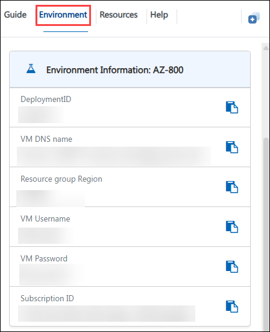
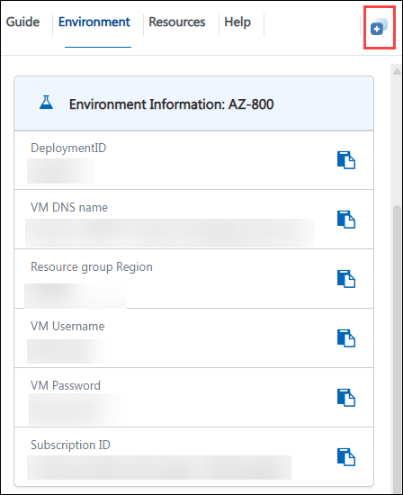
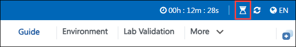

# Getting Started with Your AZ-800: Administering Windows Server Hybrid Core Infrastructure Workshop
 
Welcome to your AZ-800: Administering Windows Server Hybrid Core Infrastructure workshop! We've prepared a seamless environment for you to explore and learn about configuring and managing Windows Server on-premises, hybrid, and infrastructure as a service (IaaS) platform workloads. Let's begin by making the most of this experience:

## Overview

In these hands-on labs, you will develop the skills required to plan, implement, and manage a hybrid Windows Server core infrastructure that spans an on-premises datacenter and Microsoft Azure. Working as a Windows Server hybrid administrator for Contoso, Ltd., you will deploy and manage Active Directory Domain Services (AD DS) and Group Policy, integrate your on-premises identity infrastructure with Microsoft Entra ID, and use Windows Admin Center to administer servers consistently both on-premises and in Azure. The labs also cover Hyper-V virtualization and Windows containers, deploying and securing Windows Server on Azure VMs with Resource Manager templates, core network infrastructure services such as DHCP and DNS, hybrid virtual networking with VNet peering and Azure DNS zones, and enterprise storage solutions including Data Deduplication, iSCSI, Storage Spaces, Storage Spaces Direct, and Azure File Sync. By completing these labs, you will gain the practical experience needed to deploy, secure, connect, and troubleshoot Windows Server workloads across hybrid on-premises and Azure environments.

## Objectives

By the end of these labs, you will be able to:

1. **Implement identity services and Group Policy:** Deploy a new domain controller on Server Core, promote it remotely, manage AD DS objects, and create, link, and scope Group Policy Objects (GPOs) to enforce configuration standards.

1. **Implement integration between AD DS and Microsoft Entra ID:** Prepare Microsoft Entra ID and on-premises AD DS for integration, install and configure Microsoft Entra Connect, verify directory synchronization, and implement Entra ID Password Protection, pass-through authentication, and self-service password reset (SSPR) with password writeback.

1. **Manage Windows Server:** Install Windows Admin Center, add servers for remote administration, configure extensions, and administer servers remotely using Windows Admin Center and PowerShell remoting.

1. **Use Windows Admin Center in hybrid scenarios:** Provision Azure VMs running Windows Server using Resource Manager templates, implement hybrid connectivity with the Azure Network Adapter, and deploy and verify a Windows Admin Center gateway in Azure.

1. **Implement and configure virtualization in Windows Server:** Create and configure Hyper-V virtual switches, virtual hard disks, and virtual machines, manage them through Windows Admin Center, and install and manage Windows Server containers using Docker.

1. **Implement and configure network infrastructure services in Windows Server:** Deploy and configure highly available DHCP with failover, and deploy and configure DNS, including zones, forwarding, conditional forwarding, and DNS policies.

1. **Implement hybrid networking infrastructure:** Configure a hub-and-spoke virtual network topology in Azure with VNet peering and user-defined routes, and implement DNS name resolution using Azure private and public DNS zones.

1. **Implement storage solutions in Windows Server:** Configure Data Deduplication, iSCSI storage, redundant Storage Spaces, and Storage Spaces Direct to provide efficient, resilient, and scalable storage.

1. **Implement Azure File Sync:** Replace on-premises DFS Replication with Azure File Sync, configure sync groups and server endpoints, enable cloud tiering, and monitor and troubleshoot replication conflicts.

## Pre-requisites

- Experience administering Windows Server, including Active Directory Domain Services, DNS, DHCP, and Group Policy.
- Familiarity with core networking concepts such as IP addressing, routing, and name resolution.
- Basic knowledge of Microsoft Azure, including Azure VMs, Resource Manager templates, and virtual networking.
- Familiarity with PowerShell for administering and automating Windows Server and Azure resources will help learners get the most from this course.

## Architecture

The lab architecture demonstrates how an on-premises Windows Server infrastructure integrates with Microsoft Azure to deliver a hybrid core infrastructure. Throughout these labs, you will work across domain controllers, member servers, and admin workstations on-premises (such as SEA-DC1, SEA-ADM1, and SEA-SVR1/2/3), extend identity and management to Microsoft Entra ID and Windows Admin Center, and provision, secure, and connect Windows Server workloads running as Azure VMs.

1. **On-premises Active Directory Domain Services (AD DS):** Domain controllers and member/Server Core servers provide identity, authentication, and Group Policy-based configuration management for the Contoso.com domain.

1. **Microsoft Entra ID:** Synchronizes with on-premises AD DS through Microsoft Entra Connect to provide hybrid identity, password protection, pass-through authentication, and self-service password reset.

1. **Windows Admin Center:** Provides a single, browser-based management gateway for administering both on-premises servers and Azure VMs, including Hyper-V, containers, storage, and DNS/DHCP extensions.

1. **Hyper-V and Containers:** Host virtual machines and Windows containers on-premises, enabling virtualization proof-of-concept scenarios and container-based application deployment with Docker.

1. **Azure Virtual Networking:** Hub-and-spoke virtual networks connected through VNet peering and user-defined routes, with Azure private and public DNS zones providing hybrid and internet name resolution.

1. **Network Infrastructure Services:** DHCP (with failover) and DNS (with zones, forwarding, conditional forwarding, and policies) provide core IP addressing and name resolution services for the Contoso environment.

1. **Storage Infrastructure:** Data Deduplication, iSCSI storage, Storage Spaces, and Storage Spaces Direct deliver efficient, resilient, and scalable local and clustered storage.

1. **Azure File Sync:** Synchronizes on-premises file shares (replacing DFS Replication) with Azure file shares, enabling multi-site collaboration and cloud tiering.

## Explanation of Components

1. **Active Directory Domain Services (AD DS) & Group Policy:** AD DS stores identity objects and handles authentication for a domain. Group Policy applies centralized configuration to users and computers through GPOs linked at the domain or OU level.

1. **Microsoft Entra Connect & Microsoft Entra ID:** Microsoft Entra ID is Microsoft's cloud identity service, and Microsoft Entra Connect syncs on-premises AD DS objects into it for a single hybrid identity.

1. **Windows Admin Center:** A browser-based management console for Windows Server that provides a unified interface for administering servers on-premises and in Azure.

1. **Hyper-V:** Windows Server's native virtualization role, letting a host run multiple VMs using virtual switches and virtual hard disks.

1. **Microsoft Defender for Cloud:** Defender for Cloud assesses security posture.

1. **DHCP & DNS:** DHCP automatically assigns IP addresses from a defined scope; DNS resolves hostnames to IP addresses using zones, forwarders, and policies.

1. **Azure Virtual Network Peering & Routing:** VNet peering connects two virtual networks for direct private communication; user-defined routes (UDRs) override default routing to send traffic through a specific next hop.

1. **Azure Private & Public DNS Zones:** A Private DNS zone resolves names only within linked virtual networks; a Public DNS zone hosts internet-facing records that resolve globally.

1. **Data Deduplication, iSCSI, Storage Spaces & Storage Spaces Direct (S2D):** Data Deduplication removes redundant data to save space; iSCSI shares block storage over the network; Storage Spaces pools disks into resilient volumes; S2D extends that pooling across a failover cluster.

1. **Azure File Sync:** Synchronizes on-premises file shares with an Azure file share, keeping locations updated and optionally tiering cold files to Azure.

## Accessing Your Lab Environment
 
Once you're ready to dive in, your virtual machine and **Guide** will be right at your fingertips within your web browser.
 

### Virtual Machine & Lab Guide
 
Your virtual machine is your workhorse throughout the workshop. The lab guide is your roadmap to success.
 
## Exploring Your Lab Resources
 
To get a better understanding of your lab resources and credentials, navigate to the **Environment** tab.
 

 
## Utilizing the Split Window Feature
 
For convenience, you can open the lab guide in a separate window by selecting the **Split Window** button from the Top right corner.
 

 
## Managing Your Virtual Machine
 
1. Feel free to **Start, Stop, or Restart (2)** your virtual machine as needed from the **Resources (1)** tab. Your experience is in your hands!
 
    

2. From the **HostVM drop-down (1)** at the top of the lab environment, select the required virtual machine such as **SEA-ADM1, SEA-DC1, or SEA-SVR1 (2)**.

    

3. When logging into the Hyper-V virtual machines, if a message appears stating **"Press Ctrl+Alt+Delete to unlock"**, navigate to the **Actions** menu in the Virtual Machine Connection window and select the **Ctrl+Alt+Delete** option, as shown in the image below.

    

4. If you face an issue while copying the content from the lab guide and pasting it into the Hyper-V virtual machines, navigate to the **Clipboard** option in the Virtual Machine Connection window and select **Type Clipboard Text (Ctrl + V)**.

    
  
## Lab Guide Zoom In/Zoom Out
 
To adjust the zoom level for the environment page, click the **A↕ : 100%** icon located next to the timer in the lab environment.

   

## Lab Duration Extension

1. To extend the duration of the lab, kindly click the **Hourglass** icon in the top right corner of the lab environment. 

    

    >**Note:** You will get the **Hourglass** icon when 10 minutes are remaining in the lab.

2. Click **OK** to extend your lab duration.
 
   

3. If you have not extended the duration prior to when the lab is about to end, a pop-up will appear, giving you the option to extend. Click  **OK** to proceed. 

## Workaround for Copying PowerShell Commands

If you encounter any difficulties with copy-pasting PowerShell commands directly, you can use the following workaround:

1. Open a text editor such as Notepad on your local machine.

2. Copy the PowerShell commands from the lab guide and paste them into the text editor.

3. Ensure that the formatting of the commands remains intact.

4. Copy the commands from the text editor and paste them into your virtual machine's terminal or PowerShell window.

By following this workaround, you can ensure accurate execution of the PowerShell commands in your lab environment.

## Let's Get Started with Azure Portal
 
1. On your virtual machine, click on the **Azure Portal** icon as shown below:
 
   
    
1. You'll see the **Sign into Microsoft Azure** tab. Here, enter your credentials:
 
   - **Email/Username:** <inject key="AzureAdUserEmail"></inject>
 
      
 
1. Next, provide your password:
 
   - **Temporary Access Pass:** <inject key="AzureAdUserPassword"></inject>
 
      

1. If prompted to **Stay signed in**, you can click **No.**
 
    

1. If a **Welcome to Microsoft Azure** pop-up window appears, simply click **Maybe later** to skip the tour.

   
   
 
## Support Contact
 
The CloudLabs support team is available 24/7, 365 days a year, via email and live chat to ensure seamless assistance at any time. We offer dedicated support channels tailored specifically for both learners and instructors, ensuring that all your needs are promptly and efficiently addressed.
 
Learner Support Contacts:
 
- Email Support: cloudlabs-support@spektrasystems.com
- Live Chat Support: https://cloudlabs.ai/labs-support
 
Click "Next" from the bottom right corner to embark on your Lab journey!
 
   .png)
 
Now you're all set to explore the powerful world of technology. Feel free to reach out if you have any questions along the way. Enjoy your workshop!

