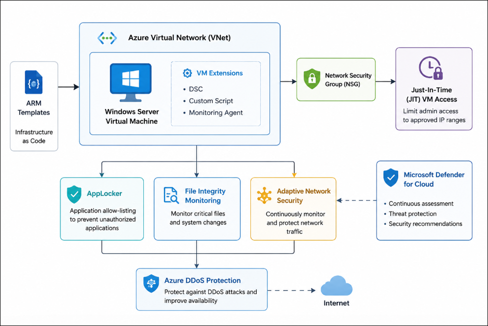
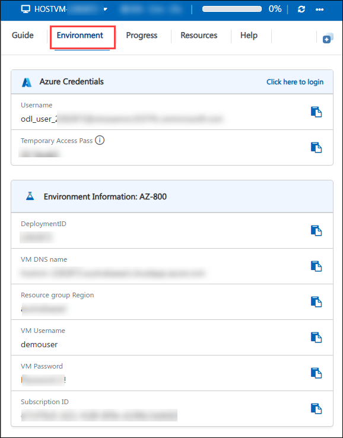
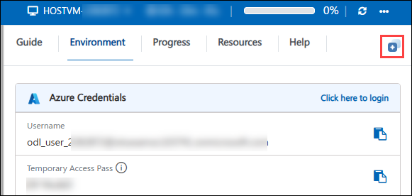

# Getting Started with Your AZ-800: Administering Windows Server Hybrid Core Infrastructure Workshop
 
Welcome to your AZ-800: Administering Windows Server Hybrid Core Infrastructure workshop! We've prepared a seamless environment for you to explore and learn about configuring and managing Windows Server on-premises, hybrid, and infrastructure as a service (IaaS) platform workloads. Let's begin by making the most of this experience:

## Lab 06: Deploying and Configuring Windows Server on Azure VMs

Overall Estimated Timing: 2 Hours 15 Minutes

## Overview 

In this hands-on lab, you will automate the deployment and configuration of Windows Server virtual machines in Azure. You will create and customize ARM templates to deploy Azure virtual machines and configure them using VM extensions. The lab also introduces additional security controls, including application allow-listing with AppLocker, file integrity monitoring, adaptive network protection, DDoS protection, and Just-In-Time (JIT) VM access management. By completing this lab, you will gain practical experience in implementing Infrastructure as Code (IaC) and applying Azure-native security capabilities to strengthen the protection and manageability of Windows Server workloads running in Azure.

## Objectives

 By the end of this lab, you will be able to: 

- **Create and customize ARM templates** to automate the deployment of Windows Server virtual machines and supporting Azure resources.
- **Configure Azure VM Extensions** to perform automated post-deployment operating system configuration tasks.
- **Deploy Windows Server virtual machines** in Azure using Infrastructure as Code principles.
- **Implement secure administrative access** through Azure security controls and Just-In-Time (JIT) VM access.
- **Enhance the security posture** of Windows Server workloads using AppLocker, file integrity monitoring, adaptive network hardening, and DDoS protection.

## Prerequisites
 Before starting this lab, you should have:

- Basic knowledge of Microsoft Azure and Azure Resource Manager.
- Familiarity with Azure Virtual Machines and networking concepts.
- Understanding of Infrastructure as Code (IaC) principles and ARM templates.
- Basic knowledge of Windows Server administration.
- Familiarity with Azure security concepts such as Network Security Groups (NSGs), Microsoft Defender for Cloud, and Just-In-Time access.

## Architecture Explaination

This architecture uses ARM Templates to automate the deployment of a Windows Server Virtual Machine within an Azure Virtual Network (VNet). VM Extensions are used to perform post-deployment configuration tasks and maintain system consistency.

Network traffic is secured through a Network Security Group (NSG), while Just-In-Time (JIT) VM Access restricts administrative access to approved users and IP addresses. AppLocker and File Integrity Monitoring help secure the operating system by controlling application execution and monitoring critical file changes.

Microsoft Defender for Cloud provides continuous security monitoring, recommendations, and threat protection, while Azure DDoS Protection safeguards internet-facing resources against denial-of-service attacks.

## Architecture Diagram

## Explanation of Components

- **Azure Resource Manager (ARM) Templates**: Automate Azure resource deployment through reusable Infrastructure as Code templates.

- **Azure Virtual Machines**: Host and run Windows Server workloads within the Azure cloud environment.
 
- **Azure VM Extensions**: Perform automated configuration and management tasks on deployed virtual machines.

- **Virtual Network and Network Security Groups**: Control and secure network traffic flowing to and from Azure resources.

- **Microsoft Defender for Cloud**: Provide continuous security assessment, monitoring, and threat protection.

- **AppLocker and File Integrity Monitoring**: Enforce application control policies and detect unauthorized file modifications.

- **Azure DDoS Protection**: Mitigate network-based attacks to maintain application availability.

- **Just-In-Time (JIT) VM Access**: Reduce exposure by granting temporary administrative access only when needed.

## Accessing Your Lab Environment
 
Once you're ready to dive in, your virtual machine and **Guide** will be right at your fingertips within your web browser.
 

### Virtual Machine & Lab Guide
 
Your virtual machine is your workhorse throughout the workshop. The lab guide is your roadmap to success.
 
## Exploring Your Lab Resources
 
To get a better understanding of your lab resources and credentials, navigate to the **Environment** tab.
 

 
## Utilizing the Split Window Feature
 
For convenience, you can open the lab guide in a separate window by selecting the **Split Window** button from the Top right corner.
 

 
## Managing Your Virtual Machine
 
1. Feel free to **Start, Stop, or Restart (2)** your virtual machine as needed from the **Resources (1)** tab. Your experience is in your hands!
 
    

2. From the **HostVM drop-down (1)** at the top of the lab environment, select the required virtual machine such as **SEA-ADM1, SEA-DC1, or SEA-SVR1 (2)**.

    

3. When logging into the Hyper-V virtual machines, if a message appears stating **"Press Ctrl+Alt+Delete to unlock"**, navigate to the **Actions** menu in the Virtual Machine Connection window and select the **Ctrl+Alt+Delete** option, as shown in the image below.

    

4. If you face an issue while copying the content from the lab guide and pasting it into the Hyper-V virtual machines, navigate to the **Clipboard** option in the Virtual Machine Connection window and select **Type Clipboard Text (Ctrl + V)**.

    
  
## Lab Guide Zoom In/Zoom Out
 
To adjust the zoom level for the environment page, click the **A↕ : 100%** icon located next to the timer in the lab environment.

   

## Lab Duration Extension

1. To extend the duration of the lab, kindly click the **Hourglass** icon in the top right corner of the lab environment. 

    

    >**Note:** You will get the **Hourglass** icon when 10 minutes are remaining in the lab.

2. Click **OK** to extend your lab duration.
 
   

3. If you have not extended the duration prior to when the lab is about to end, a pop-up will appear, giving you the option to extend. Click  **OK** to proceed. 

## Workaround for Copying PowerShell Commands

If you encounter any difficulties with copy-pasting PowerShell commands directly, you can use the following workaround:

1. Open a text editor such as Notepad on your local machine.

2. Copy the PowerShell commands from the lab guide and paste them into the text editor.

3. Ensure that the formatting of the commands remains intact.

4. Copy the commands from the text editor and paste them into your virtual machine's terminal or PowerShell window.

By following this workaround, you can ensure accurate execution of the PowerShell commands in your lab environment.

## Let's Get Started with Azure Portal
 
1. On your virtual machine, click on the **Azure Portal** icon as shown below:
 
   
    
3. You'll see the **Sign into Microsoft Azure** tab. Here, enter your credentials:
 
   - **Email/Username:** <inject key="AzureAdUserEmail"></inject>
 
      
 
3. Next, provide your password:
 
   - **Temporary Access Pass:** <inject key="AzureAdUserPassword"></inject>
 
      

5. If prompted to **Stay signed in**, you can click **No.**
 
    

6. If a **Welcome to Microsoft Azure** pop-up window appears, simply click **Cancel**

    

 
## Support Contact
 
The CloudLabs support team is available 24/7, 365 days a year, via email and live chat to ensure seamless assistance at any time. We offer dedicated support channels tailored specifically for both learners and instructors, ensuring that all your needs are promptly and efficiently addressed.
 
Learner Support Contacts:
 
- Email Support: cloudlabs-support@spektrasystems.com
- Live Chat Support: https://cloudlabs.ai/labs-support
 
Click "Next" from the bottom right corner to embark on your Lab journey!
 
   .png)
 
Now you're all set to explore the powerful world of technology. Feel free to reach out if you have any questions along the way. Enjoy your workshop!

